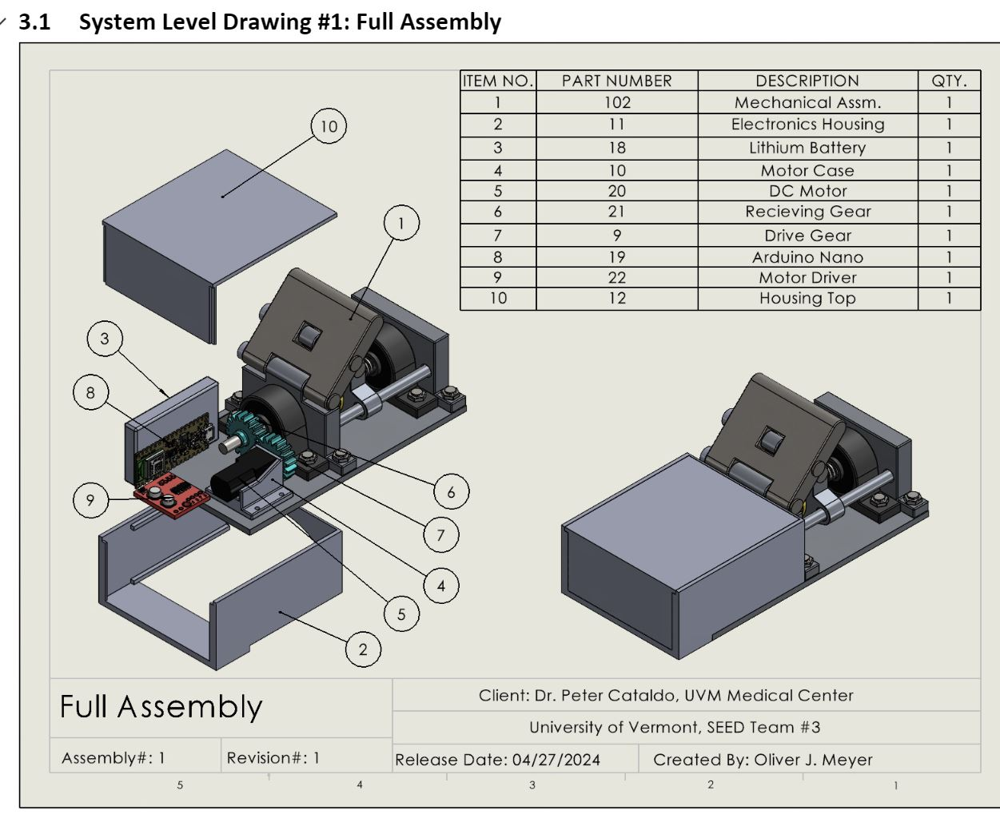
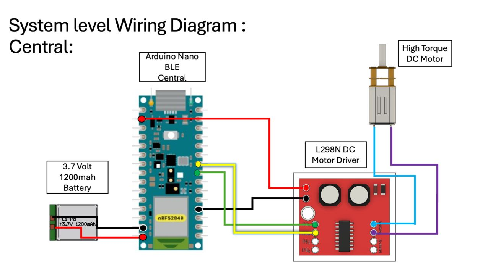
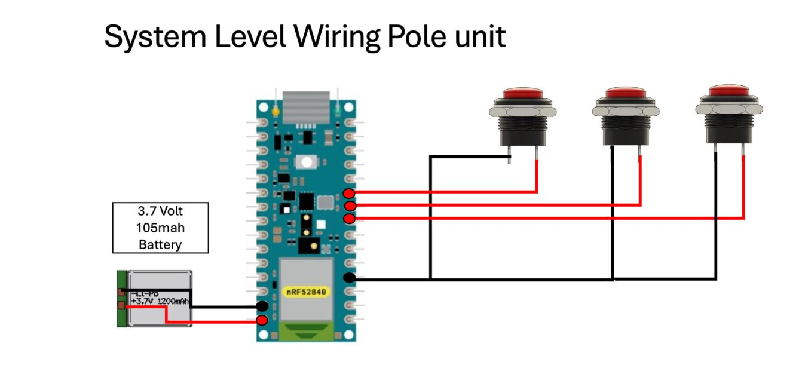

# BLE-Button-Heel-riser-
Senior Design project final code and schematics. This code serves to be a demonstration of the final product and to provide an open source Bluetooth low energy (BLE) guide to arduino Nano BLE. 

This project uses 2 Arduino BLE sense rev2, to communicate over the Arduino BLE library and protocol, note other BLE peripherals and centrals will conflict with the given library. I.E: if you plan to use an ESP32 microcontroller, you will need two to communciate. A single Arduino and ESP32 cannot communicate with this library. 

The basis of this project was to create a easier method to lifting an Back Country skiing heel riser. Current methods require the skier to bend down and flip the riser manually, or use their pole. This final iteration uses a linear actuator and DC motor to move the heel riser up or down. 

### Wiring Schmeatics 

 

The automatic heel riser works in a simple manner, the user is able to press the up or down button on the pole mounted unit (Peripheral). Once activated the Arduino inside the heel riser (central) recieves the Bluetooth signal as a hex (1 or 0). The BLE library allows both units to save power by remaining in a low power state until a button is pressed and recieved. 

Once a button press is received the Arduino inside the heel riser communicates with the DC motor driver to either move in the forward or reverse direction. The code operates such that each button press actiavtes a time step. Where the timesteps control how long the motor turns, this can be tuned to meet unique hight settings. Currently its set up to be a 3 stage manner. The final project code is named: 
Peripheral_pole.ino & Central_heel_riser.ino

### Working Prototype Images 

![alt text](
